## Drywall Issues: Here's What We're Seeing

> **Quick disclaimer:** I'm *not* a drywall expert—just a homeowner documenting some drywall issues we've noticed around our house. If you're seeing something similar, it might be wise to consult a professional for a closer look.

Within the first year of owning our new home, we've spotted various cracks, nail pops, odd bulges around the house, laughable mounts of extra caulking, and even areas where the drywall just crumbled away.

### Noted issues

- Cracking – Cracking at joints throughout the house.
- Nail Pops – Nails bulging out drywall or straight up popping out of the wall.
- Corner Beads – Corner in hallways and cutouts bulging and cracking.
- Paint Defects – Paint cratering / bubbling.
- Excess Caulking – Comical amounts of extra caulking.
- Drywall Defects – Areas that just crumble if lightly tapped.

**Garage Entry Hallway – Cracking / Nail Pop**

Issues like this are pretty common through the transitions and other areas which have drywall corners such as this.

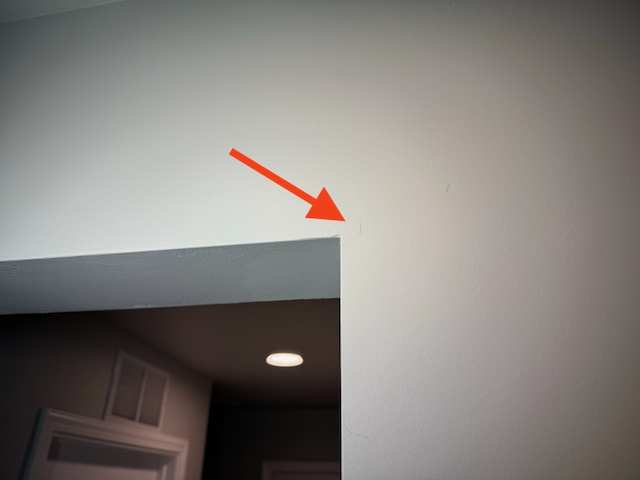

**Garage Entry Hallway – Cracking / Nail Pop – Close Up**

**Garage Entry Hallway – Cracking / Corner Bead / Paint Defects**

Here we will see more corner beads causing cracking and protruding. Then we also see some paint defects where it almost looks like there were air bubbles that escaped, causing holes in the drywall.

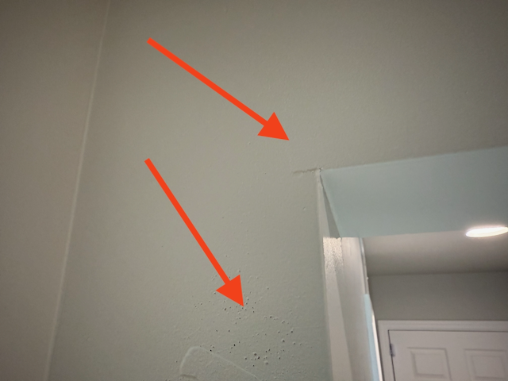

**Garage Entry Hallway – Cracking**

Many areas have cracks going up the walls between where two pieces of drywall meet.

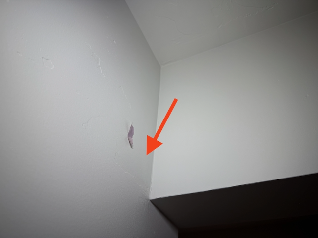

**Garage Entry Hallway – Cracking – Zoom**

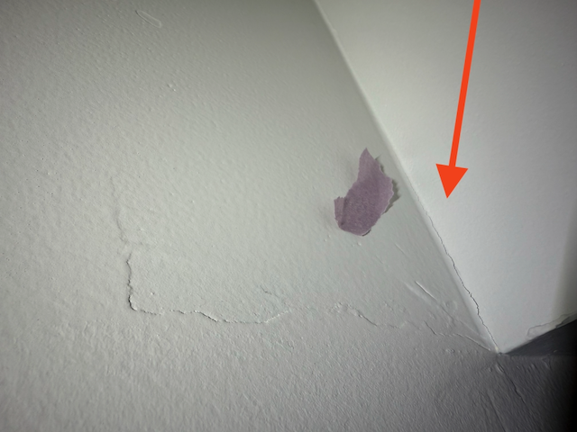

**Pantry – Cracking / Odd Buldge Defect**

I’m not exactly sure what is going on here, but there seems like there is some sort of buried material like drywall paper or tape starting to get pushed out from the wall.

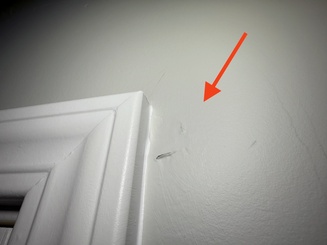

**Stairs – Cracking**

Again more areas where the drywall is cracking at the seams. This is a common issue throughout the house.

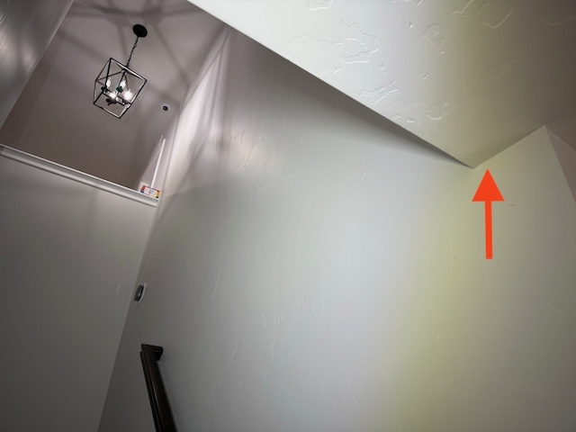

**Stairs – Cracking – Zoom**

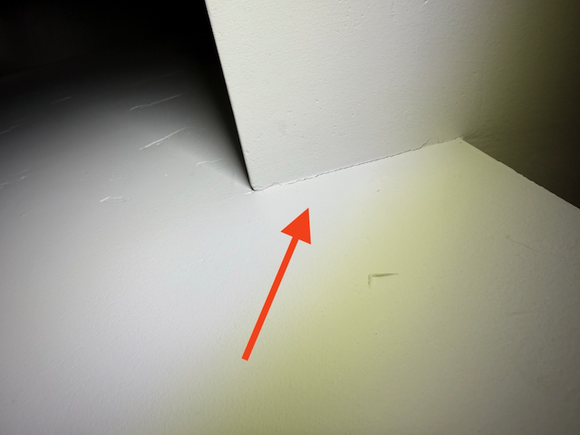

**Dining Room - Nail Pop / Cracking**

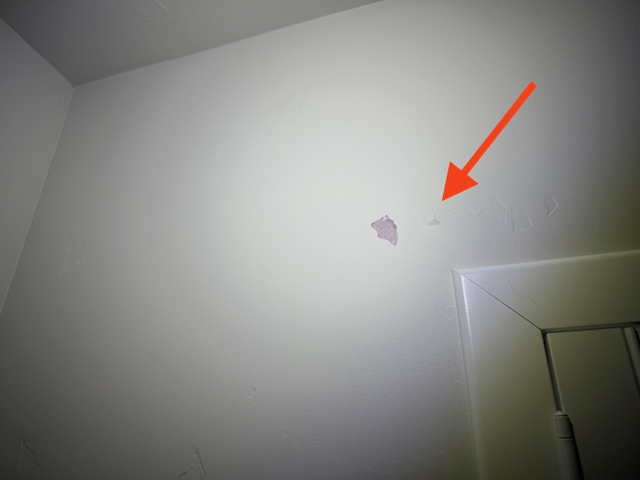

**Dining Room - Nail Pop / Cracking – Zoom**

There are nail pops and prepopping pretty much everywhere. I’m not sure if this is a result of the house settling or just poor installation, but it’s pretty common throughout the house.

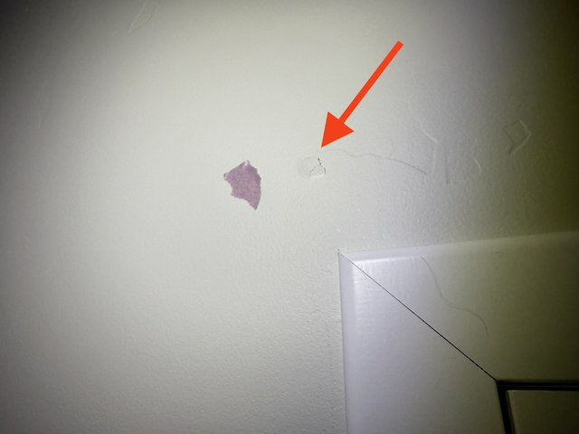

**Dining Room - More Nail Pop / Cracking**

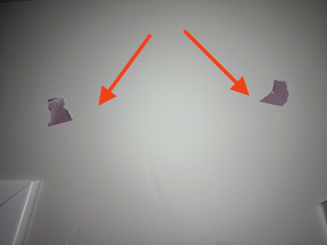

**Kids Bedroom – Cracking / Nail Pop**

One of the kids rooms has three different areas where the drywall is cracking and the nails are popping out. There are more areas, but these ones are the most noticeable.

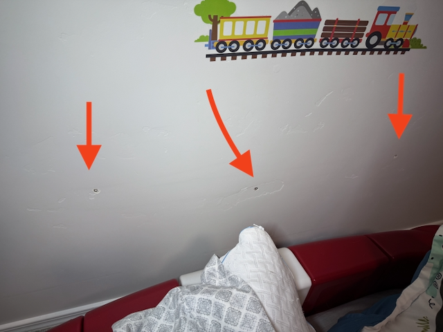

**Kids Bedroom – Cracking / Nail Pop – Zoom 1**

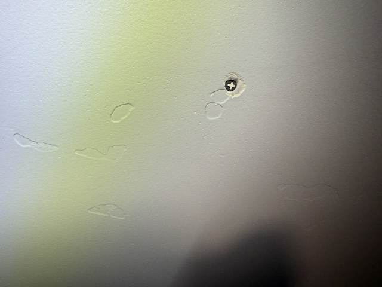

**Kids Bedroom – Cracking / Nail Pop – Zoom 2**

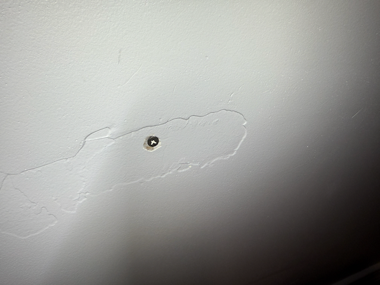

**Kids Bedroom – Cracking / Nail Pop – Zoom 3**

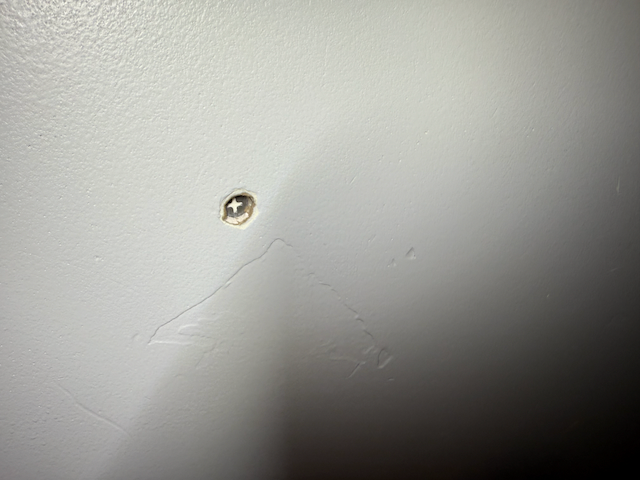

**Master Bathroom – Cracking / Nail Pop**

This one is coming from the ceiling.

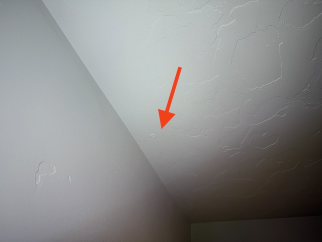

**Master Bathroom – Lot of caulking**

I have no idea why there is so much caulking here. It’s like they just went nuts with the caulking gun. I’m not sure if this is a defect or just a poor install, but it’s pretty excessive.

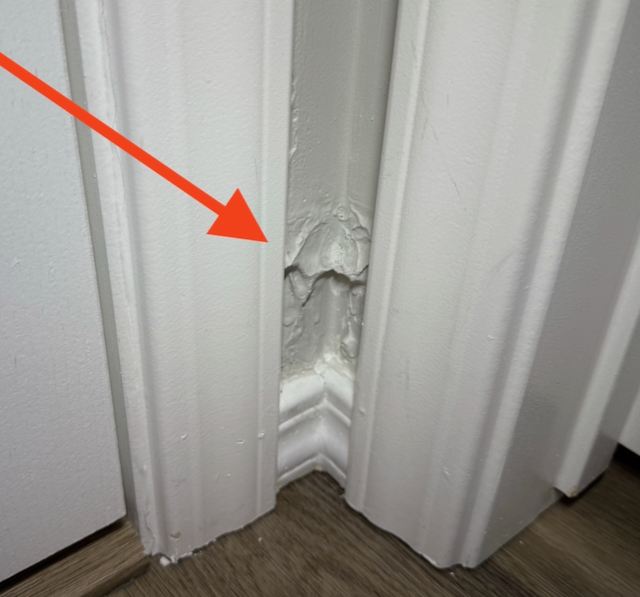

**Master Closet – Drywall Cracking Along Wall and Ceiling**

This one started out just as a small crack, but it has grown over time.

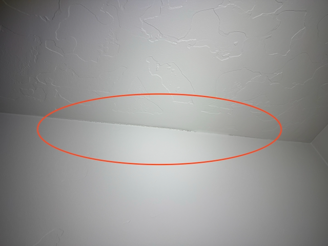

**Master Closet – Drywall Failure**

This one was a real oddity. I saw a small indentiation, almost straight line in the drywall. I thought it was a nail pop or some other random defect, but when I tapped it lightly, the drywall crumbled away. It was like the drywall had just given up.

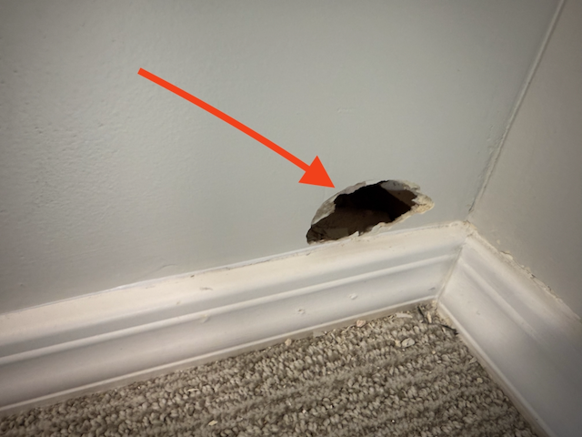
