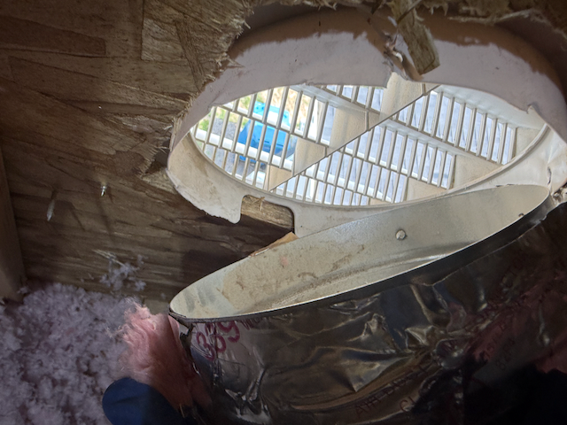
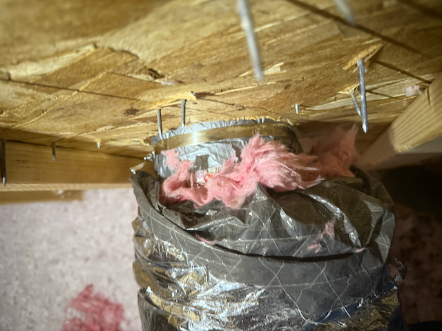

# Our Fresh-Air Intake Came Loose – Here’s What We’re Seeing and Why We’re Concerned

> **Quick disclaimer:** I’m *not* an HVAC pro. I’m just a homeowner documenting what we found in the attic and what I’ve pieced together from manuals, code language, and a couple of air-quality gadgets. If you spot something similar, definitely follow up with a licensed technician.

---

## What We Discovered

Up in the attic we found that the **flexible, fresh-air intake duct has pulled away from the exterior wall collar and is now hanging loose**. Instead of bringing clean outdoor air into the HVAC return, the flex duct ends inside the unconditioned attic—which is full of loose fiberglass insulation, unconditioned air, and other things I really don't want piped into my home.

I took a few quick photos and opened a warranty claim, but while we wait I wanted to understand the possible risks for the family.

**Detached Duct Side**

**Detached Duct Top**

---

## Why We *Think* It Matters

| What Could Go Wrong                | How I Figure It Might Affect Us                                                                                                                          |
| ---------------------------------- | -------------------------------------------------------------------------------------------------------------------------------------------------------- |
| **Dusty indoor air**               | The furnace/air-handler could be sucking attic air (dust, insulation fibers, debris) straight into the supply ducts and circulating it around the house. |
| **Extra moisture & possible mold** | Humid attic air in summer—or cold, damp attic air in winter—could condense inside the flex duct or on the coil, leading to mold.                         |
| **HVAC strain & higher bills**     | The system was sized for outdoor make-up air. Pulling attic air instead of exterior air can throw off pressure balance and make the blower work harder.  |
| **Combustion-safety risk**         | Gas appliances need fresh air to vent properly. Starved make-up air can cause back-drafting of exhaust gases.                                            |
| **Energy penalty**                 | Conditioned indoor air leaks out while unconditioned attic air is pulled in—raising heating and cooling costs.                                           |
| **Code headaches**                 | Per IRC M1602.2, return air must not come from an attic.                                                                                                 |

---

## Clues From Our Air‑Quality Monitors

We have several in‑home sensors that track CO₂ and VOC levels. **Lately, whenever the HVAC kicks on, those readings jump—even if we’ve cracked a few windows.** We can’t prove the loose duct is the only culprit, but it’s our leading suspect right now.

---

## What I’ve Done Temporarily

Until the builder can make a permanent repair, I’ve **taped and clamped the duct in the attic**.  
This is strictly a stop‑gap to try to keep the system working as intended by not pulling in nasty stuff into the system; it is **not** a long‑term fix.

---

**Temporary Fix**

## What We’re Hoping the Fix Looks Like

We’re not experts, but from what we’ve read and seen, a good repair might include a few basic things:

1. **Reconnecting or replacing the loose duct** so it actually reaches outside again—and stays there.
2. **Sealing up the hole** where the duct goes through the wall or roof, so attic air doesn’t sneak in around it.
3. **Fastening everything securely** so the duct doesn’t just pop off again in a few months.
4. **Double-checking airflow** to make sure the HVAC system is getting enough outside air like it was designed to.

That’s our best guess after poking through a few code references and builder materials. Mostly, we just want it fixed right the first time so we’re not revisiting this later.

---

### Bottom Line
A loose flex duct dumping attic air into the return looks like a recipe for dust, possible moisture, and wasted energy. We’re hoping a proper reconnection will level out our CO₂/VOC readings and keep the HVAC system happy.
