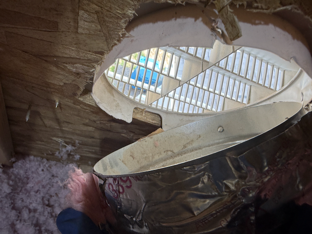

# “Fresh-Air” Intake – What I’ve Learned

> **Note:** I’m a homeowner piecing this together while a CBH warranty request is still pending (no repair date yet as of writing this post).

---

## What I Found in the Builder Setup
| Item                     | Observation                                                                                                                                                                                                                                                                                                         |
| ------------------------ | ------------------------------------------------------------------------------------------------------------------------------------------------------------------------------------------------------------------------------------------------------------------------------------------------------------------- |
| Fresh-air flex duct      | Runs from an exterior hood into the main return plenum. In theory this should supply fresh outdoor air.                                                                                                                                                                                                             |
| Small blue filter screen | **Was missing during the home inspection.** Our independent home inspector flagged the absence, so CBH added a light‑blue screen afterward. It arrived with **no label, no MERV rating, and no guidance on when or how to replace it. The screen also had holes and gaps around the edges, letting air bypass it.** |

Because CBH never provided a rating—or even basic maintenance instructions for the screen—it was impossible to know whether the material could handle smoke, pollen, or fine dust.

---

## My Interim Upgrade
I replaced that unknown screen with a darker-blue **MERV-1 pad** (photo below).  
All incoming outdoor air now passes through this pad before it mixes with return air from the house, but MERV-1 only stops coarse debris. Fine smoke and pollen still get through.

**Original Filter**

**Updated MERV-1 Filter after only 2 months during fire season (Summer 2024)**

---

## Air-Quality Monitor Results
| Scenario | Before any pad | With MERV-1 pad |
|----------|----------------|-----------------|
| Boise wildfire smoke events | Indoor readings jumped to **“Unhealthy”** within an hour. | Peaks now settle near **“Moderate.”** An improvement, but still not ideal. |
| High-pollen days | Noticeable spikes on the monitor. | Spikes are lower, yet still present. |

---

## Extra Twist: Detached Duct in the Attic
During an attic check I discovered the **flex duct had completely pulled away** from the intended exterior wall outlet. It looks like the duct’s weight or tension tore the **plastic collar** clean off—right through the screw holes where it was originally mounted. There was **no collar left in place**, only a zip tie loosely holding the duct near the wall. As a result, the system is now grabbing a mix of attic air and outdoor air.

**Detached duct in the attic**

---

## Planned Fix After the Duct Is Re-Attached
1. **Install a prefab filter box directly after the exterior intake,** using a rated filter to tackle smoke and fine dust.  
2. Keep the standard whole-house filter at the furnace as a second layer.  
3. Re-check air-quality readings during the next smoke event to confirm the improvement.

---

## Take-Aways for Fellow Homeowners
* A fresh-air duct only helps if it’s **sealed** and uses a **properly rated filter**.  
* If the builder supplies an unlabeled screen with no maintenance guidelines, consider what is coming into your home unfiltered.  
* In wildfire or high-allergy regions, filtering the intake air to **MERV 8–13** before it hits the return plenum can make a big difference.  
* Periodically verify that the duct is still clamped to the exterior hood; vibration and settling can loosen fittings.
